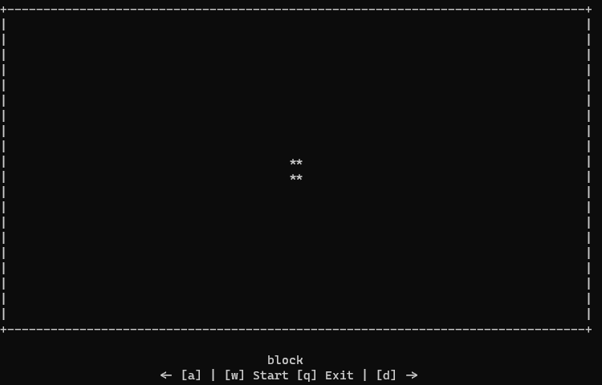

# Conway's game of life

Small app written in python with curses as UI that simulates conway's game of life.

Only package required to run this app on Windows OS is Curses. Install Curses using `pip` (`pip install curses`). Unix systems should have Curses included in standard Python.

Custom patterns must be added to patterns.py file.

